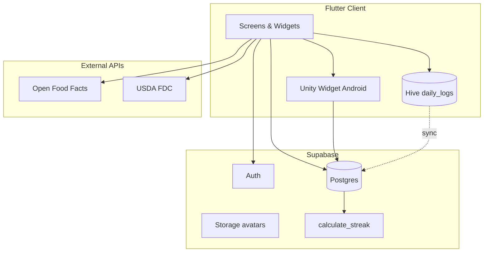

# Cosarc — Architecture Report (Phase 1 Audit)

**Date:** June 15, 2026  
**Project:** Cosarc — Cinematic Fitness & Discipline  
**Stack:** Flutter 3.3+, Supabase, Hive, Unity (Android)

---

## 1. Current Architecture

### Pattern
- **Monolithic Flutter client** with imperative navigation (`MaterialPageRoute`)
- **No global state library** — `StatefulWidget` + `setState()` throughout
- **Backend:** Supabase (Auth + Postgres + optional Storage)
- **Local cache:** Hive (`daily_logs` box for food entries)
- **3D workouts:** Unity embedded via `flutter_unity_widget` (Android only)

### Entry Flow
```
main.dart
  → Hive init (FoodLog adapter)
  → SupabaseConfig.initialize()
  → CosarcApp (auth listener)
  → AppStartScreen (intro video)
  → Login | OnboardingWrapper | DashboardRoot
```

### Navigation Shell
`DashboardRoot` uses `IndexedStack` with 4 tabs:
| Tab | Screen | Purpose |
|-----|--------|---------|
| Cosmos | `CosmosScreen` | Daily contract hub, streak, workout/fuel/water |
| My Gym | `MyGymScreen` | Gym check-in timer (mock features) |
| Nutriwave | `NutriwaveScreen` | Meal marketplace UI (mock catalog) |
| AI | `CosarcAIScreen` | Chat UI (placeholder responses) |

### Folder Structure
```
lib/
├── core/           # Config, Supabase, theme tokens
├── models/         # FoodLog (Hive), OnboardingData (unused)
├── services/       # Auth, nutrition APIs, daily contracts
├── screens/        # Feature screens by domain
└── widgets/        # Shared UI (doodle bg, streak island, design system)
supabase/migrations/  # Postgres schema + RLS
android/unityLibrary/ # Unity IL2CPP export
lib_backup/           # Pre-Supabase snapshot (reference only)
```

---

## 2. State Management

| Concern | Mechanism |
|---------|-----------|
| Auth session | Supabase client + listener in `main.dart` |
| Food logs | Hive + `ValueListenableBuilder` |
| Profile/contracts | Per-screen fetch in `initState` |
| Onboarding | Local `Map` in `OnboardingWrapper` → Supabase update |

**Gap:** No centralized app state; repeated `AuthService().getMemberId()` calls.

---

## 3. Database Structure (Supabase)

| Table | Purpose |
|-------|---------|
| `members` | User profile linked to `auth.users` |
| `streaks` | Workout streak tracking |
| `daily_contracts` | Daily goals (workout, nutrition, water, steps) |
| `workout_logs` | Unity workout submissions |
| `food_logs` | Server-side food log backup (new) |

**RPC:** `calculate_streak(p_member_id)` — updates streak after workout.

---

## 4. API Integrations

| Integration | Status |
|-------------|--------|
| Supabase Auth | Email/password + Google OAuth |
| Open Food Facts | Active (no key) |
| USDA FoodData | DEMO_KEY / env-configured |
| Nutritionix, Edamam, Spoonacular | Placeholder keys |
| Cosarc AI | Mock only |
| Unity 3D | Android muscle selector |

---

## 5. Authentication Flow

1. **Email signup** → `auth.signUp` → insert `members` + `streaks`
2. **Google OAuth** → web redirect or native `google_sign_in` → `signInWithIdToken`
3. **Auth listener** in `main.dart` ensures member row exists
4. **Onboarding gate:** `members.age == null || age == 0`
5. **Logout** → `signOut` → navigate to `LoginScreen`

---

## 6. Technical Debt

| Item | Severity |
|------|----------|
| Duplicate `cosarcPink` constants across files | Low |
| Dead code: `DashboardScreen`, `TestConnectionScreen`, `OAuthWebViewScreen`, `OnboardingData`, `IndianFoodDatabase` | Medium |
| Broken named route in legacy `SuccessScreen` | Fixed |
| `nutrition_logged` not synced from food logging | Fixed |
| Release signing uses debug keystore | High (deployment) |
| iOS lacks Unity integration | Medium |
| Package ID still `com.example.cosarc_shell` | Medium |

---

## 7. Architecture Diagram



---

## 8. Changes Applied (Post-Audit)

- Centralized design system: `lib/core/theme/`
- Environment-based secrets: `lib/core/config/app_config.dart`
- Production schema + RLS: `supabase/migrations/`
- `DailyContractService` for contract sync
- Premium UI components: `lib/widgets/cosarc/`
