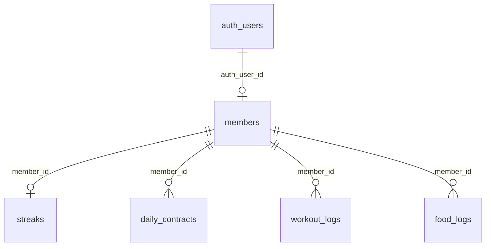

# Cosarc — Backend Readiness Report

**Date:** June 15, 2026  
**Supabase URL:** https://lgblxxixgldizfidscpz.supabase.co

---

## 1. Services Inventory

### Existing (Client-Integrated)
| Service | Status |
|---------|--------|
| Supabase Auth (email + Google) | ✅ Integrated |
| `members` CRUD | ✅ Integrated |
| `streaks` read/create | ✅ Integrated |
| `daily_contracts` CRUD | ✅ Integrated |
| `workout_logs` insert | ✅ Integrated |
| `calculate_streak` RPC | ✅ Integrated |
| Open Food Facts HTTP | ✅ Client-side |
| USDA FDC HTTP | ✅ Client-side |

### Missing / Mock
| Service | Status |
|---------|--------|
| Cosarc AI backend | ❌ Mock responses only |
| Nutriwave ordering | ❌ Mock UI |
| My Gym real check-in | ❌ Mock timer |
| Steps sync (HealthKit/Google Fit) | ❌ Read-only display |
| Server-side food log sync | ⚠️ Table created, client partial |
| Push notifications | ❌ Not implemented |
| Edge Functions | ❌ Not deployed |

---

## 2. Database Schema (Delivered)

See migrations:
- `supabase/migrations/20250615000001_initial_schema.sql`
- `supabase/migrations/20250615000002_rls_policies.sql`

### Entity Relationships


---

## 3. Storage Buckets

| Bucket | Access | Purpose |
|--------|--------|---------|
| `avatars` | Private, user-folder RLS | Profile photos (future) |

---

## 4. Deployment Steps

```bash
# Install Supabase CLI
npm install -g supabase

# Link project
supabase link --project-ref lgblxxixgldizfidscpz

# Apply migrations
supabase db push

# Verify RLS
supabase db lint
```

### Supabase Dashboard Configuration
1. **Authentication → Providers:** Enable Google OAuth
2. **Authentication → URL Configuration:** Add redirect URLs for web/mobile
3. **API Settings:** Copy anon key → CI as `SUPABASE_ANON_KEY`
4. **Database → Extensions:** Ensure `pgcrypto` enabled

---

## 5. Edge Functions (Recommended)

| Function | Purpose |
|----------|---------|
| `search-food` | Proxy nutrition APIs, hide keys, rate limit |
| `cosarc-ai` | LLM chat with auth + usage limits |
| `sync-food-log` | Persist Hive entries to `food_logs` |

---

## 6. Frontend Integration Status

| Feature | Backend Connected |
|---------|-------------------|
| Signup/Login | ✅ |
| Onboarding save | ✅ |
| Daily contract | ✅ |
| Workout log | ✅ |
| Nutrition log (local) | ✅ Hive |
| Nutrition contract flag | ✅ Fixed via `DailyContractService` |
| Profile | ✅ |
| AI chat | ❌ |
| Nutriwave cart | ❌ |

---

## 7. Backup Strategy

| Asset | Strategy |
|-------|----------|
| Postgres | Supabase daily backups (Pro) + `pg_dump` weekly |
| Auth users | Supabase managed |
| Storage | Supabase bucket replication (Pro) |
| Migrations | Version-controlled in `supabase/migrations/` |
