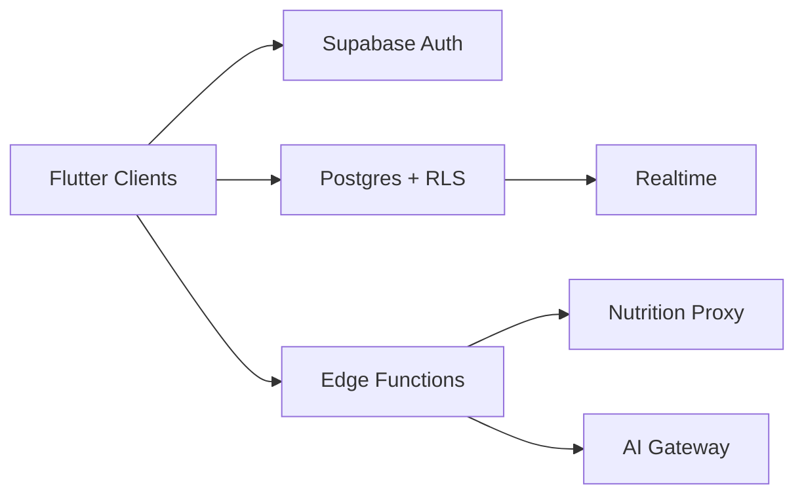

# Cosarc — Scalability Report

**Date:** June 15, 2026

---

## 1. Current Limitations

| Layer | Limitation |
|-------|------------|
| Client | Monolith — all features in single Flutter app |
| State | No caching layer; each screen re-fetches Supabase |
| Nutrition | Client-side multi-API aggregation won't scale at volume |
| AI | Mock responses — no backend |
| Realtime | Not used (could benefit streak/contract sync) |
| Food logs | Hive primary, partial Supabase sync |
| Unity | Android-only; blocks iOS feature parity |

---

## 2. Database Scalability

**Current schema supports:**
- ~100K users with proper indexing (member_id, contract_date)
- Daily contracts partitioned naturally by date queries

**Indexes provided:**
- `idx_members_auth_user_id`
- `idx_daily_contracts_member_date`
- `idx_workout_logs_member_date`
- `idx_food_logs_member_date`

**Future scaling:**
- Partition `daily_contracts` by month at 1M+ rows
- Move nutrition search to Edge Function + Redis cache
- Add `gym_sessions`, `meal_orders` tables when features go live

---

## 3. API Rate Limits

| API | Free Tier | Risk |
|-----|-----------|------|
| USDA DEMO_KEY | 30 req/hr | High — use real key |
| Nutritionix | 200/day | Medium |
| Open Food Facts | Unlimited (fair use) | Low |
| Supabase | Plan-dependent | Monitor auth + DB connections |

---

## 4. Multi-Platform Scaling

| Platform | Status |
|----------|--------|
| Android | Production-ready with Unity |
| iOS | Auth + UI ready; Unity not integrated |
| Web | OAuth supported; Unity N/A |
| Tablet/Desktop | Responsive constraints added; needs layout pass |

---

## 5. Horizontal Scaling Path

**Phase 2 backend (roadmap):**
1. Edge Function: `search-food` — aggregate APIs server-side
2. Edge Function: `cosarc-ai` — LLM with rate limits
3. Realtime subscriptions on `daily_contracts` for multi-device sync
4. Background sync: Hive → `food_logs` table
